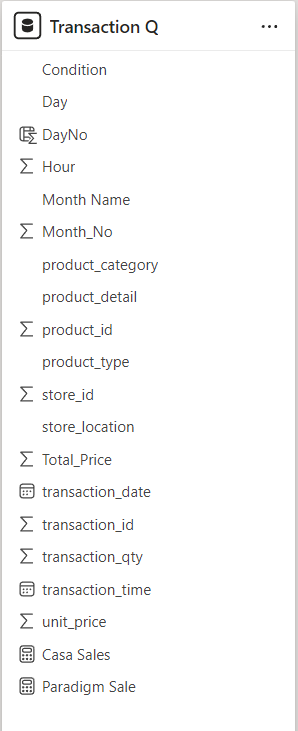

# Project Background

The Sales & Marketing Department faces challenges in optimizing sales and marketing efforts due to a lack of visibility into the performance of product categories across two stores.

Without insights into daily and hourly sales patterns, the department struggles to make data-driven decisions about inventory management, resource allocation, and promotional strategies, potentially leading to missed revenue opportunities and inefficiencies.

### **Key pain point?**
- Lack of targeted marketing: Without clear pattern, marketing efforts are often broad and less effective.
- Staff shortage: Difficulty in making the right shift schedule for staff, resulting in slower services especially during peak hour/day
  
### **Insights and recommendations are provided on the following key areas:**

- **Promotional Analysis:** Identify top-selling products and optimal times for promotions.
- **Key Performance Indicators (KPIs):** measureable metrics can drive performance and help the coffee shop achieve its goals.
- **Peak Hour Identification and Dynamic Scheduling:** to avoid staff schedule conflicts.

An interactive Tableau dashboard used to report and explore sales trends can be found here: [Tableau](https://public.tableau.com/app/profile/kamila.rashid/viz/CoffeeShopSales_17253764575110/Dashboard1).

## Data Structure & Initial Checks

    

# Executive Summary

## Overview of Findings

- The coffee shop generated $241.5K in total sales, with hot beverages dominating the top-selling products, particularly the Hot Flat White and Hot Cappuccino.
- Casa Luna performed steadily, while Paradigm Mall contributed the most sales overall.
- Weekend are the busiest while peak-hours are between 9am - 12pm.
  

    

## Insights Deep Dive

### Peak Hours and Days

- Monday and Wednesdays have the lowest sales figures at $29.84K and $26.09K respectively while the weekend have the highest sales figures.
- Peak sales occur between 9 AM and 12 PM, which is the most significant period for sales revenue and sales are consistently lower in the afternoon (after 12 PM) and evening.

### Sales Overview:

- **Sales by Store:** Paradigm Mall is the highest revenue driver with $146.1K, indicating strong performance at this location. Monitoring individual store performance will help understand regional preferences and sales trends.
- **Product Performance:** Hot beverages are the top revenue generators, with Hot Flat White accounting for 19.02% of total hot beverage sales. This then followed by cake desserts and cold beverages.

## Recommendation

Based on the insights derived from RFM analysis, here are strategic recommendations:

**1. Promotional Analysis:**
   - Consider offering cross-selling promotion during peak hours to boost sales and introduce less popular item that costumers might interested
   - Offering discounts especially during less popular days which could improve traffic during off-peak days.

**2. Key Performance Indicators (KPIs):**
- Establish KPIs to measure the success of marketing efforts, customer satisfaction, and staff efficiency.
- Choose metrics that directly align with company's objectives. Ensure they are quantifiable, so progress over time cn be track.
- Example of metrics includes average rating from customer feedback surveys, percentage increase in sales over a specific period or sales growth and percentage of repeat customers.

**3. Peak Hour Identification and Dynamic Scheduling:** 
- Implement a flexible staffing model based on sales forecasts for peak hours. Utilize historical data to create more effective shift schedules, reducing wait times and improving service quality.
- During peak-off hours, reducing staffing or offering happy hour deals during these periods could help increase foot traffic.
# Conclusion

As conclusion, this analysis can help sales and marketing department in identifying the popular demand by customer for each store, find out whether the choice of beverages condition and type of products has anything to do with the operation hour or day and overall performance of each stores.
